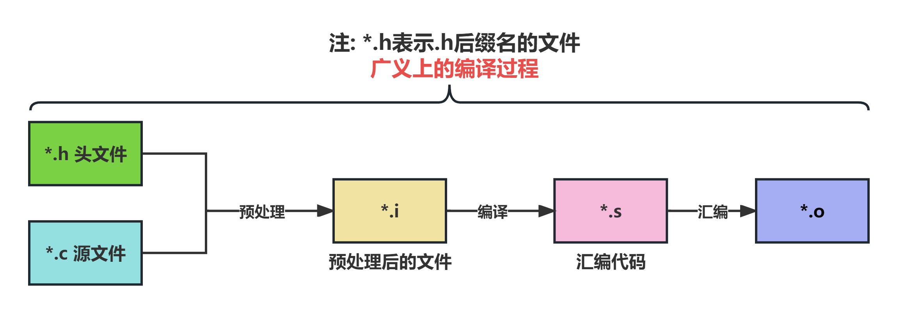
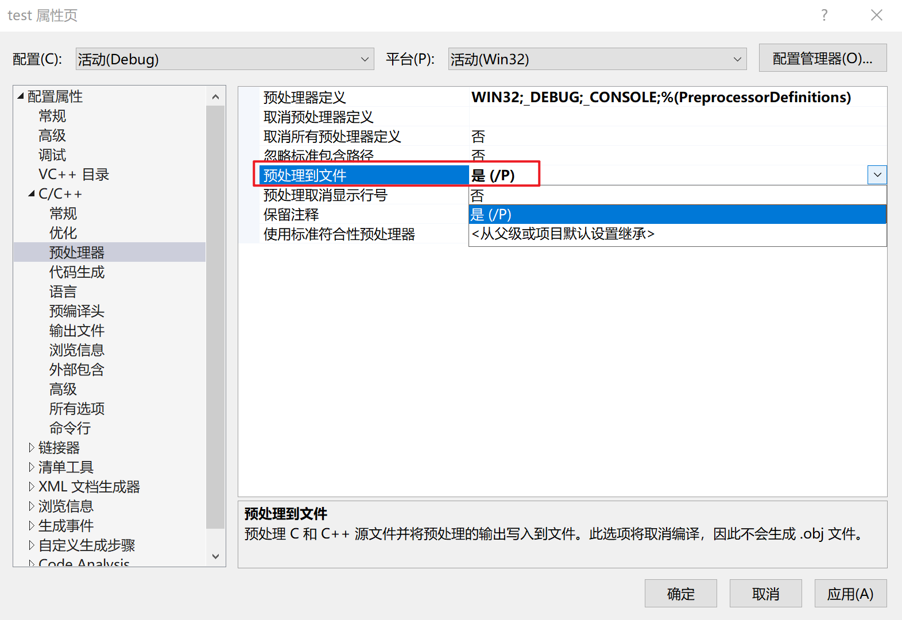
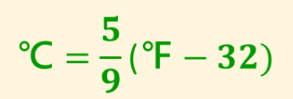
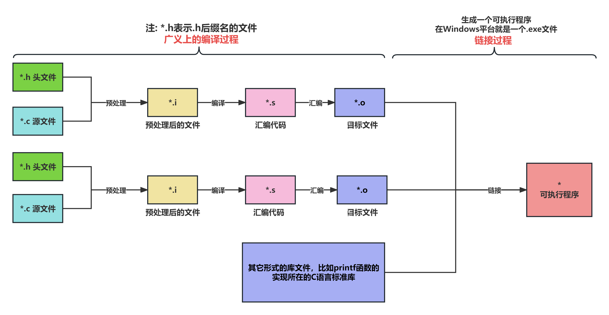
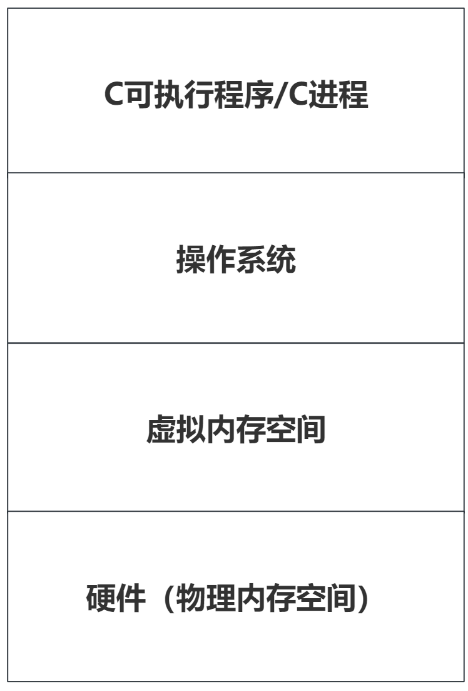
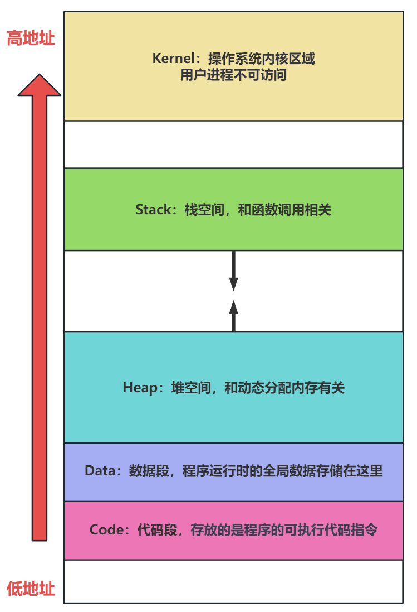
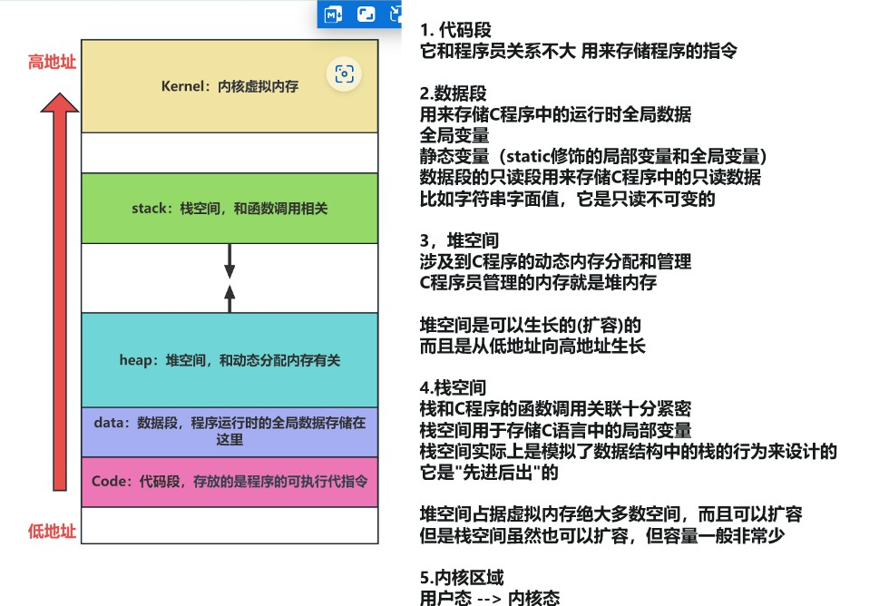
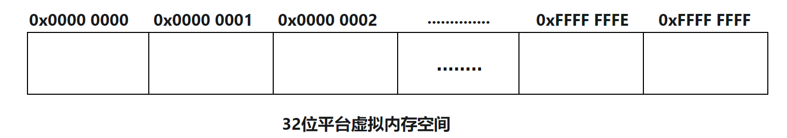
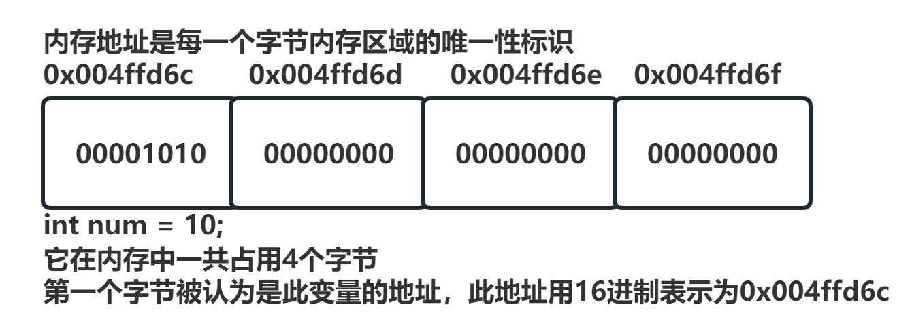

# C程序执行过程


## 概述

本小节主要讲解一个C程序从源代码到最终执行的过程，这个过程又可以细分为两部分：

1. 源代码到可执行文件的过程
2. 可执行文件在内存中执行

本小节是C语言基础当中，比较容易被初学者忽视的知识点。而实际上：

1. **熟悉C程序从源文件，经过一系列过程成为一个可执行文件的过程。**
2. **理解C程序在内存中执行的虚拟内存空间。**

是C程序员非常重要的基本功，本小节是C语言基础中的重点。

我们首先研究一下C语言程序，从源码到可执行文件的过程。这个过程总的来说，可以分为两大步骤：

1. 编译
2. 链接


## 广义编译的过程

从广义上来说，一个C语言源文件编译的过程可以分为以下三个小步骤：


图 1. C源文件编译的过程


1. 预处理，把一个.c文件处理成.i文件。
2. 编译，把.i文件进一步处理成.s文件。**狭义上来说，编译就是指编译器处理.i文件生成.s文件的过程。**
3. 汇编，把.s文件最终处理得到.o文件。

下面逐一讲解这三个小步骤。

**细节/注意事项：**

**广义上的编译过程，最终得到的是一个".o"文件，它并不是一个可执行文件。**

汇编过程结束后，实际还需要一个链接过程，才能得到一个可执行文件。


## 预处理过程

预处理是C语言源文件编译处理的第一步，由**预处理器**来完成。那么预处理器到底干啥呢？

答：执行预处理指令。

在前面的小节中，我们已经简单讲解过了hello world程序，也知道了一条预处理指令：

```c
#include <stdio.h
```

实际上，在C语言代码中，以"#"开头的指令就是预处理指令。预处理指令有多种形式，在今天我们先学习两种最常见的形式：

1. "#include"：用于包含头文件。
2. "#define"：用于定义宏或者常量。

下列讲解一下这两种预处理指令，分别完成什么操作。

**补充：注释的处理**

我们都知道注释是不参与编译更不会影响代码的执行的。而实际上，注释的处理是在预处理阶段完成的：

**在预处理阶段，代码中的注释会被预处理器忽略丢掉。**那么从预处理器过程开始，后续的所有过程注释都不会参与了。


### 查看预处理.i文件

在VS当中，默认情况下，点击按钮启动程序，并不会保留预处理后的.i文件。为了能够看到这个.i文件，我们需要让VS的编译过程停留在预处理阶段。可以按照以下步骤设置：

右键点击项目 --属性 --C/C++ --预处理器 --预处理到文件 --设置从否改成是。效果图如下：

  

完成以上设置后，再重新点击按钮启动程序，打开项目的本地文件，在Debug文件夹下就可以找到该.i文件。（当然项目此时是无法运行成功的。）

注：如果项目仍成功运行，可以打开项目的本地文件删除Debug这个文件夹，或者点击"VS主界面 --生成 --重新生成解决方案"即可。


### #include包含头文件

include，具有包含的意思。预处理指令"#include"，用于包含头文件。

头文件，即.h为后缀的文件，头文件一般用于声明函数、结构体类型、变量等。（关于头文件的详细使用，我们后面再讲）

简单来说，你可以认为该预处理指令的作用就是：

**找到该头文件，把其中的内容处理后复制到指令所在的位置。**

比如一个基础的hello world程序：

```c
#include <stdio.h>
int main() {
    printf("Hello, world!\n");
    return 0;
}
```

预处理过程就是执行指令:

> \#include <stdio.h>

预处理器会先找到`stdio.h`头文件，然后将其内容**处理后复制**到`#include `的位置。大体上，可以把"#include"当成一次文本复制的过程。这样，编译器在编译代码时就可以访问`stdio.h`中定义的所有函数和变量。

比如前面讲的printf函数，就是由于预处理机制，才能够被我们自己的程序去调用。

**了解/扩展**

包含头文件的预处理过程并不仅仅是一个简单的文本替换或复制粘贴操作。

预处理器会执行一系列任务，其中包括条件编译、宏替换等，这会影响头文件内容如何整合到源文件中。

所以，预处理后的 `.i` 文件可能不会简单地是原 `.c` 文件和 `.h` 文件内容的组合，而是这些文件在经过预处理器处理后的结果。但大体上，预处理后的结果文件会包含两个文本的原本内容。


### #define定义符号常量

预处理指令"#define"的第一个常见作用，是给字面常量起个名字，使得程序员可以更方便得在程序中使用一个字面常量。

这种使用#define指令定义的常量，被称之为**符号常量（Symbolic Constants）**。

举例：

```c
#include <stdio.h>
#define PI 3.14f
#define N 6

int main(void) {
    printf("圆的半径是2，周长是：%f\n", PI * 2 * 2);
    printf("N * 2 + 2 = %d\n", N * 2 + 2);

    return 0;
}
```

最终程序的输出结果是：

> 圆的半径是2，周长是：12.560000
>
> N * 2 + 2 = 14

通过查看.i的预处理后的文件：该指令实际上就是把代码中的**符号常量替换成实际的字面常量**，比如上述两行printf代码预处理后就会变成：

> printf("圆的半径是2，周长是：%f\n", 3.14f * 2 * 2);
>
> printf("N * 2 + 2 = %d\n", 6 * 2 + 2);


**为什么非要给字面常量起个名字？直接用不好吗？**

主要有两个好处：

1. **提高代码的可读性**。使用名称而非直接用字面常量可以使代码更易于理解。
2. **易于维护**。如果某个常量需要更改，你只需要在 `#define` 指令中更改它，而不需要遍历整个代码库去替换。
3. **避免魔法数字（magic number）**。编程领域把代码中直接出现的、意义不明的一个字面常量称为"魔法数字、魔数"，避免魔数在代码中直接出现是一个好的编程习惯。建议使用有意义的符号常量名字，来提高代码的可读性和可维护性。

**所以，对于C语言代码编写中需要使用的字面常量，尤其是频繁使用的、带有确定意义的字面常量，请将它设置为符号常量。**

**定义符号常量的注意事项**

使用#define定义符号常量，应注意：

1. 符号常量的本质是文本替换，它的定义和使用，没有任何数据类型、取值范围等的限制。这既是优点带来了灵活性，但也会带来一定的安全隐患。
2. **采取这种方式定义符号常量，在命名时采取"全大写英文单词 + 下划线分割"的风格！**
3. 定义时，添加必要的符号后缀，比如float类型的字面常量可以明确加"f"后缀。这有利于增加代码可读性，以及为编译器提供更多信息。

### #define定义函数宏

什么是宏？

在C语言中，**宏**是一种由**预处理器**处理的代码生成机制。简单地说，宏可以看作是一种用于在编译前、预处理阶段自动替换代码片段的方式。在C语言中，`#define` 指令通常用于创建宏。

上面讲的通过#define定义符号常量，也是定义了一个宏，你可以叫常量宏或者宏常量。

当然，这里要讲C语言中的函数宏。

函数宏的定义会稍微复杂一点，参考以下格式：

```c
// 定义了一个函数宏，用于求长方形的周长
#define RECTANGLE_PERIMETER(length, width) (((length) + (width)) * 2)
// 定义了一个函数宏，用于求两个数的平方差
#define SQUARE_DIFF(x, y) ((x) * (x) - (y) * (y))
#include <stdio.h>

int main(void) {
    // 调用函数宏
    printf("长和宽分别是10和5的长方形，其周长是：%d\n", RECTANGLE_PERIMETER(10, 5));
    printf("3和2的平方差是：%d\n", SQUARE_DIFF(3, 2));
    return 0;
}
```


很显然，运行结果是：

长和宽分别是10和5的长方形，其周长是：30

3和2的平方差是：5

函数宏的本质仍然是文本替换，但会复杂一点，相当于把调用宏函数时的参数传入公式直接计算，比如上述两行printf代码预处理后就会变成：

printf("长和宽分别是10和5的长方形，其周长是：%d\n", (((10) + (5)) * 2));

printf("3和2的平方差是：%d\n", ((3) * (3) - (2) * (2)));

### 函数宏的优点

使用函数宏在C语言中能带来一些好处：

1. 代码复用，简化代码，提高可读性啥。
2. 提升性能。函数宏虽然叫函数，但本质是文本替换，而且是预处理阶段就完成替换，这完全不会消耗运行时性能。
3. 灵活。既然本质是文本替换，那么带使用函数宏时给不同类型的参数都是可以的。

### 注意事项

使用函数宏时，主要注意以下几点：

1. 函数宏调用的本质是在预处理阶段的文本替换，要切记函数宏和函数完全不是一回事。（这一点在后续讲函数后，可以加深理解）
2. **函数宏的命名采取"全大写英文单词 + 下划线分割"。比如"SQUARE_AREA"，该宏的名字表示求正方形的面积。**这样命名的宏
3. 函数宏适用于替换程序中一些简短的、但反复执行的函数。**不要定义很复杂的函数宏。**

**函数宏定义时"()"的运用**

我们先给出三条结论：

1. 定义函数宏的表达式内部在有必要时要用小括号括起来，以确保函数宏内部的运算的顺序是正确的。
2. **函数宏表达式中的每一个参数，都必须用小括号括起来！！！**
3. **函数宏的整个表达式部分也必须用小括号括起来！！！**

下面逐一举例说明为什么要这么做。

比如宏函数定义：

代码块 5. C++

```c
#define RECTANGLE_PERIMETER(length, width) (((length) + (width)) * 2)
```

`((length + width) * 2)`当中的`(length + width)`小括号就是必须要添加的，不添加宏内部的运算顺序就不正确了。

第二条要求宏函数表达式的每一个参数都要用小括号括起来，这是为什么呢？

假如宏函数如下：

代码块 6. C++

```
#define SQUARE_DIFF(x, y) x * x - y * y     // 这个宏定义是错误的，这里只是演示
```

参考下列代码：

代码块 7. C++

```
printf("%d\n", SQUARE_DIFF(1 + 2, 1 + 1));
```

**结果是表达式"32 - 22"的值吗？**

显然不是，这是因为预处理替换的结果是：

代码块 8. C++

```
printf("%d\n", (1 + 2 * 1 + 2) - (1 + 1 * 1 + 1));
```

计算出来的结果是： (5) - (3) = 2

第三条要求宏函数的整个表达式要用小括号括起来，原因也类似。比如下列宏函数定义：

代码块 9. C++

```
#define SQUARE_DIFF(x, y) (x) * (x) - (y) * (y)     // 这个宏定义是错误的，这里只是演示
```

假如按照下列方式调用宏：

代码块 10. C++

```
printf("%d\n", SQUARE_DIFF(3, 2) * 10);
```

结果是表达式"(32 - 22)  * 10"吗？

显然也不是，这是因为预处理替换的结果是：

代码块 11. C++

```
printf("%d\n", ((3) * (3)) - ((2) * (2)) * 10);
```

计算出来的结果是：9 - 4 * 10 = 9 - 40 = -31

总之，由于函数宏调用的本质是文本替换，本身不涉及任何计算规则优先级，所以以上三点加括号的原则是一定要注意遵守的！！

## #define设置编译选项和scanf函数

在C语言中，`#define` 预处理指令通常用于定义宏，但也可以用来**设置编译选项**，从而影响编译过程。简而言之，在预处理阶段，`#define` 可以被用来调整编译器的行为，进而改变最终生成的代码。

在这里我们要讲解一个案例，并讲解一下scanf函数的使用。

实现以下功能：

键盘输入一个华氏温度（Fahrenheit temperature），程序输出对应的摄氏度（Celsius temperature）。

注：3


图 3. 华氏温度转换成摄氏度的公式


F代表华氏度，C代表摄氏度。

**在这个公式中：**

1. **32代表华氏温度的冰点（Freezing point）**
2. **5 / 9 是华氏温度和摄氏温度之间转换的比例因子（scale factor）**

举例：

键盘录入一个华氏温度212，程序会输出一个摄氏度100。

在这个程序中，涉及到了键盘输入。所以我们要使用scanf函数。它是标准输入/输出库中，另一个重要的函数，代表输入。

scanf也并不是一个单词，而是词组"scan formatted"的缩写，意为“格式化扫描”。表示按照指定的格式，读取输入数据。默认情况下，是从键盘接收数据输入。

下列一行代码表示读入一个int类型的数据，并赋值给变量i（变量i需要先声明）：

代码块 12. C


```
scanf("%d", &i);
```

下列一行代码表示读入一个float类型的数据，并赋值给变量x（变量x需要先声明）：

代码块 13. C


```
scanf("%f", &x);
```

**注意：变量名的前面需要加一个取地址运算符"&"，表示将读取的数据存入目标地址中，不要忘记写"&"符号。**

这个程序代码并不难写，我们可以写出以下代码：

###### 

代码块 14. 华氏温度转换为摄氏度-代码1


```c
#include <stdio.h>

int main(void){
    float fahrenheit;
    printf("请输入一个华氏温度：");
    scanf("%f", &fahrenheit);

    float celsius = 5 / 9 * (fahrenheit - 32);

    printf("这个华氏温度对应的摄氏度是：%f", celsius);
    return 0;
}
```


这段代码有语法错误吗？可以正常执行吗？

这段代码实际是没有语法错误的，但**在VS当中**却不可以直接运行，这是因为"坑爹的"微软编译器MSVC，不允许此代码执行。原因是：

'scanf': This function or variable may be unsafe. Consider using scanf_s instead. To disable deprecation, use _CRT_SECURE_NO_WARNINGS. 

**scanf函数是不安全的，所以MSVC编译器不允许代码中直接使用scanf函数**，而是：

1. 选用更安全的"scanf_s"函数
2. 使用"_CRT_SECURE_NO_WARNINGS"来禁用安全警告。

注意：

1. "_CRT_SECURE_NO_WARNINGS"这个字符串中，"CRE"是"C Runtime"的缩写，整个字符串表示C语言运行时不安全函数的警告。
2. 对“不安全”函数的警告是MSVC编译器特有的；其他编译器通常不会有这样的限制。
3. `scanf_s`是微软特有的函数，并不是C标准库的一部分，不兼容标准C语言，在其它平台、编译器环境下不可以使用。
4. 在后续的课程，更多在Linux上运行C程序，不会选择MSVC编译器。

因此，为了代码的可移植性和跨平台兼容性，我们选择禁用这个特定的编译器警告。

那么如何禁用这个安全警告呢？答：使用"#define"宏定义语法。具体而言就是让代码变成：

###### 

代码块 15. 华氏温度转换为摄氏度-代码2

```c

#define _CRT_SECURE_NO_WARNINGS // 宏定义禁用安全警告
#include <stdio.h>

int main(void){
    float fahrenheit;
    scanf("%f", &fahrenheit);

    float celsius = 5 / 9 * (fahrenheit - 32);

    printf("这个华氏温度对应的摄氏度是：%f", celsius);
    return 0;
}
```


此时代码正常通过编译启动，但程序的输出结果对吗？实际上，这个程序，不管你键盘录入什么数据，结果都是：

0

为什么呢？

很简单，因为计算摄氏度的表达式中存在："5 / 9"。这实际上是两个整数字面常量直接相除，结果还是一个整数，5 / 9 结果是0，那么后面无论输入什么，结果肯定都是0。

那怎么改呢？

很简单，不要使用两个整数常量相除，而使用浮点数，参考代码如下：

###### 

代码块 16. 华氏温度转换为摄氏度-代码3

```c

#define _CRT_SECURE_NO_WARNINGS
#include <stdio.h>

int main(void){
    float fahrenheit;
    printf("请输入一个华氏温度：");
    scanf("%f", &fahrenheit);

    float celsius = 5.0f / 9.0f * (fahrenheit - 32);

    printf("这个华氏温度对应的摄氏度是：%f", celsius);
    return 0;
}
```

如此，我们就得到了一个合格的"华氏度转换成摄氏度"的C程序。

但合格不意味着优秀，这段代码还是可以继续优化的。代码中直接出现的"5.0f / 9.0f"、"32"这样的字面量，也就是魔数，是不规范的。

所以我们可以通过**宏定义符号常量**的方式，指明它们的含义，去掉魔数。参考下列代码：

###### 

代码块 17. 华氏温度转换为摄氏度-代码4

```c

#define _CRT_SECURE_NO_WARNINGS
#include <stdio.h>
// 华氏温度的冰点32
#define FREEZING_POINT 32
// 华氏温度转换成摄氏度的比例因子
#define SCALE_FACTOR (5.0f / 9.0f)

int main(void){
    float fahrenheit;
    printf("请输入一个华氏温度：");
    scanf("%f", &fahrenheit);

    float celsius = SCALE_FACTOR * (fahrenheit - FREEZING_POINT);

    printf("这个华氏温度对应的摄氏度是：%f", celsius);
    return 0;
}
```


上面的例子给的是用符号常量的方式，当然也可以用**函数宏**的方式，参考下列代码：

###### 

代码块 18. 华氏温度转换为摄氏度-代码5

```c
#define _CRT_SECURE_NO_WARNINGS
#include <stdio.h>
#define FREEZING_POINT 32
#define SCALE_FACTOR (5.0f / 9.0f)
#define TO_CELSIUS(fahrenheit) (SCALE_FACTOR * ((fahrenheit) - FREEZING_POINT))

int main(void){
    float fahrenheit;
    printf("请输入一个华氏温度：");
    scanf("%f", &fahrenheit);

    float celsius = TO_CELSIUS(fahrenheit);

    printf("这个华氏温度对应的摄氏度是：%f\n", celsius);
    return 0;
}
```


注：函数宏也是代码的一部分，在定义函数宏时也要尽量避免魔数。

**对于程序员而言，写出代码实现功能是最基本最起码的要求。但作为一名优秀的程序员，写出可读性更好、性能更强、更优良的代码也是毕生的追求。**

## 预处理过程总结

预处理过程主要就两个作用：

1. 执行预处理指令，展开宏(进行处理文本替换)。
2. 丢弃代码中的注释。

通俗的说，你可以认为预处理后得到的`.i`文件是一个无预处理指令，无注释以及无宏定义的源代码文件。

预处理过程得到的仍然是一个源代码文件，这个文件的内容人肉眼是完全可以看懂的。

最后再谈几个细节问题：

1. 预处理指令包含字符"#"，还存在一些单词如"define"、"include"等，需要注意的是：

   1. "#"不是C语言标识符中允许出现的字符，所以不要把预处理指令理解成标识符。
   2. "define"、"include"等也不属于关键字，不要理解成关键字。

2. 预处理指令也不要理解成语句，不要在预处理指令的末尾加`;`，也不要使用`=`等字符。诸如下列预处理指令的写法都是不正确的：

   1. 代码块 19. C++

      ```
#include <stdio.h;     // 末尾不能加分号, 预处理指令不是语句
      ```
      
   2. 代码块 20. C++

      ```
#define MESSAGE = "Happy new year!"     // 宏常量定义不需要使用等号
      ```

3. 以上。

# 编译过程(狭义)

在预处理完成后，**编译器（Compiler）**就开始处理预处理生成的.i文件了，这个过程就被称为为**（狭义上的）编译**。

编译器在这个过程，主要完成以下工作：

1. 进行词法分析、语法分析、类型检查等操作。
2. 编译器还在此阶段对代码进行各种优化，以提高效率，减少最终生成代码的大小。
3. **最终，将预处理后的源代码转换成汇编语言。**也就是将`.i`文件转换成`.s`文件。

一个汇编代码的演示：

###### 

代码块 21. HelloWorld的C语言代码

```c
#include <stdio.h>

int main(void){
    printf("hello world! \n");
}
```

其可能生成的汇编代码如下：

###### 

代码块 22. HelloWorld的C语言代码-对应汇编代码

```c
.LC0:
  .string "hello world! "
main:
  push    rbp
  mov     rbp, rsp
  mov     edi, OFFSET FLAT:.LC0
  call    puts
  mov     eax, 0
  pop     rbp
  ret
```

值得注意的是，C语言最初是为了替代更低级的B语言和汇编语言而设计的。因此，C语言源代码被编译成汇编代码是完全符合其设计初衷的。

生成汇编代码的过程中，编译器还会自动对代码进行优化，但对于一般的C程序员而言，编译器或汇编语言都不是必须掌握的知识点。

# 汇编过程

编译器完成编译后，**汇编器（Assembler）**会将这些汇编指令转换为目标代码（机器代码），生成了一个`.o(或者.obj)`文件。从这一步生成的文件开始，文件中的内容就不是程序员能够肉眼看懂的文本代码了，而是二进制代码指令。

**所以汇编过程的主要作用就是将汇编语言代码转换成机器语言，即转换成机器可以执行的指令，也就是生成`.o`文件。**

.o文件还不是一个能直接执行的文件，因为它可能依赖于其他外部代码，比如在代码中调用`printf`函数。

**预处理阶段不是已经包含头文件，为什么还说要依赖外部代码？**

头文件中往往只有函数的声明，包含头文件大概只意味着预处理器告诉编译器：

“这里有一个函数叫做`printf`，它大概是这个鬼样子，后续的代码中会用到这个函数。你先知道有这么个玩意，别给我报错，至于这个函数到底是干啥的，做什么的，你先别管。”

所以汇编后的代码，还需要经历一个链接的步骤，来依赖外部代码才能够真正的运行。

# 链接的过程

在链接阶段，链接器（Linker）会把项目中，经过汇编过程生成的多个(至少有1个)`.o`文件和程序所需要的其它附加代码整合在一起，生成最终的可执行程序。

比如你在代码中调用了标准库函数，那么链接器会将库中的代码包含到最终的可执行文件中。

# 总结编译和链接

经过预处理、编译、汇编和链接这四个主要步骤，源代码最终会被转换成可执行文件。

虽然具体的转换过程可能因平台、编译器等因素有所不同，但这四个核心步骤是通用的。对于大多数C程序员来说，掌握这些基本概念有助于更深入地理解和应用C语言。

整个流程参考下图：


图 4. 编译和链接完整过程


当然幸运的是，这些工作在普通的开发中，也确实不需要我们操心了。我们只需要点几个按钮，或者输入几行命令就可以自动完成编译和链接的过程。比如：

1. 在Windows平台，我们使用集成开发环境Visual Studio，它提供了易用的界面和命令行工具来自动化编译和链接过程。
2. 在Linux平台，GCC（GNU Compiler Collection）是最常用的编译工具套件。我们也只需要在终端使用几行简短的命令，也可以快速完成编译和链接的过程。

# 进程虚拟内存空间

C源文件经过预处理、编译、汇编、链接后，生成可执行文件，这就是一个C语言可执行程序（Program）。可执行文件被操作系统加载到内存中，程序得以运行，运行的程序我们称之为"进程（Process）"。

此时操作系统会为每一个进程分配**独属于进程的，唯一的虚拟内存空间**。那么什么是虚拟内存空间呢？

虽然这更多是操作系统课程中的概念，但大家至少还是需要了解一下：

**什么是虚拟内存空间？**

**在现代操作系统中，虚拟内存是一种重要的内存管理功能，它使得进程能够使用一个独立于物理内存容量的、看似连续的地址空间。这个地址空间被称为"虚拟内存空间"。**

"虚拟"这一术语用于描述这种机制，因为每个进程获得的内存空间并不是实际物理内存中连续的一段。实际上，这些虚拟地址都是由操作系统与硬件（主要是内存管理单元，MMU）共同管理，以映射到物理内存地址。

当一个进程启动时，它所“看到”的是操作系统为其分配的这种连续的虚拟内存空间，而这些虚拟地址并不直接等同于实际的物理内存地址。

实际上虚拟内存空间可以看作是操作系统和物理内存之间的一个抽象层，如下图所示：


图 5. 虚拟内存空间-分层示意图


这种分层的设计，具有以下优点：

1. **降低了内存管理的复杂性，提高了内存管理的效率。**操作系统现在只需管理虚拟地址到物理地址的映射，简化了内存分配和回收的过程。
2. 增强系统安全性和稳定性。由于每个进程都有自己独立的虚拟内存空间，因此相互之间难以直接访问或干扰，从而提高了安全性。
3. 通过一些内存管理的技术，可以实现更灵活、更高效的内存管理。举例如下：
   1. 基于虚拟内存空间的技术，操作系统甚至可以将磁盘的空间暂时作为内存空间使用（虚拟内存技术），这使得运行大型应用程序变得可能，即使在物理内存不足的情况下也能保持运行。
   2. 内存复用。同一片物理内存可以被多个进程使用，但在进程各自的虚拟内存空间中，进程仍然是隔离的。
4. **简化软件开发。由于程序员只需考虑虚拟地址空间，因此无需担心物理内存的具体布局和限制，大大简化了开发过程。**

总之，一系列的好处使虚拟内存成为现代操作系统中不可或缺的一部分。

## 虚拟内存空间模型

为了更直观的从C程序的视角理解虚拟内存空间，帮助C程序员更好的管理和操作内存，我们用虚拟内存空间模型来描述虚拟内存空间。

虚拟内存空间模型将一个C进程的虚拟内存空间，划分为几个不同的内存区域，这些内存区域存放的数据、用途、特点等皆有不同，是我们后续学习课程的重点！

虽然不同的平台、操作系统在虚拟内存空间模型上可能会有所差异，但虚拟内存空间模型普遍包括以下几个关键部分：


图 6. 进程虚拟内存空间-模型图




从低地址到高地址，虚拟内存空间模型的内存区域包括：

1. **代码段(Code)：**
   1. 代码段一般位于虚拟内存空间的最低地址处。
   2. 代码段用于存放一个C程序编译后得到的可执行代码指令，一般是只读的。
   3. C程序员的操作一般不涉及代码段。
2. **数据段(Data)：**
   1. 数据段用于存放程序运行时具有静态存储期限的全局数据，包括：全局变量和静态变量(static修饰的局部变量和全局变量)
   2. 数据段还用于存储程序运行时的只读数据**(只读数据段)**，比如字符串字面值。
3. **堆空间(Heap)：**
   1. 堆空间是虚拟内存空间中C程序员最关注的区域，没有之一。
   2. 堆空间涉及到C程序的动态内存分配和管理，我们常说C语言可以操作和管理内存，最主要说的就是管理堆空间。对堆空间的自由管理，也是C语言和其他语言（如Java）的重要区别！
   3. 堆空间往往占据虚拟内存空间的大部分，它可以按照程序员的需求，自由的从低地址向高地址生长。
4. **栈空间(Stack)：**
   1. 栈空间也是C程序员比较关注的内存区域。
   2. C语言是一门以函数调用为核心的编程语言，而栈空间保障了函数调用的正常进行，决定了函数调用的流程。
   3. 栈空间的特点是"先进后出"。它会随着函数调用从高地址向低地址生长，也会随着函数调用结束裁剪内存空间。栈空间的大小往往十分有限，内存占用远小于堆空间。
   4. **C程序中的局部变量数据存储在栈空间中。**
5. 内核区域(Kernel)：
   1. 内核区域由操作系统内核使用，存储内核代码和内核级的数据结构。
   2. 应用程序通常不能直接访问内核空间。但涉及到"系统调用"时，应用程序会从"用户态"转入"内核态"，此时应用程序就可以访问内核区域了。

好了，我相信你看完这一段描述，有些看懂了，有些则还有些摸不到头脑。但都没有关系，在随后的课程中，我们会逐步讲解这些内存区域，不需要着急。

## 内存地址的概念

相信每一位对C语言有一丢丢了解的同学，都听说过"内存地址"的概念。那么什么是内存地址呢？

**什么是内存地址？**

内存地址是（虚拟）内存空间中某个位置的唯一性标识。由于现代计算机的最小寻址单位是8位1个字节，所以我们可以直接认为，**内存地址就是虚拟内存空间中某1个字节区域的唯一性标识。**

和内存地址相对应的还有一个非常重要的概念：**变量地址**

**什么是变量地址？**

变量地址：**变量地址就是变量所占内存空间的第一个字节的内存地址。**

比如一个32位（4字节）的整数变量，那么这个变量的地址指的是这4字节中的第一个字节的地址。

C语言提供了专门的取地址运算符"&"，它一般用于和一个变量名结合，如"&a"，用于取变量a的内存地址。当然此时你得到的就是变量a的第一个字节的内存地址。

**注意：**

在C语言编程中，我们提到的"内存地址"总是指虚拟内存空间地址，简称"虚地址"。

## 地址值

内存地址是虚拟内存空间中某1个字节区域的唯一性标识，为了直观地描述这些地址，我们使用了"地址值"这个概念。**在大多数情况下，"地址"和"地址值"可以被视为同一概念。**

**高地址和低地址的概念**

在描述虚拟内存地址时，我们可以把虚拟内存空间想象成一个多单元(多字节)组成的数组，每个单元都有其唯一标号"索引"，这个"索引值"就是其地址值。

**所以地址值的取值范围就是[0, 最大地址]。**这样我们就得到了"低地址"和"高地址"两个不同的概念：

1. 低地址：位于内存取值范围的较低端，即接近0的地址。
2. 高地址：相对于低地址而言，高地址指的是内存范围中接近最大地址的部分。

例如，假设有一个内存范围从地址0x1000到地址0x2000：

1. 0x1000就是这个范围的低地址。
2. 0x2000就是这个范围的高地址。

明确高、低地址的概念十分重要，比如：

1. 我们描述虚拟内存空间，当我们说从"低地址到高地址"，意味着从代码段到内核虚拟内存这样的内存排布。
2. 堆（heap）通常从低地址开始向高地址增长，栈（stack）则从高地址开始向低地址增长。

那么对于一个具体的平台而言，虚拟内存空间的最大地址是什么呢？

实际上，虚拟内存空间的最大地址通常由平台的地址位数决定。目前主流的平台有两种：

1. 32位架构平台
2. 64位架构平台

### 32位系统平台

**32位的系统架构：**

地址总位数是32位，虚拟内存空间中存在232个可能的地址，也就是对应232个字节（即4GB）的虚拟内存空间。这232个可能中：

1. 最小的可能（低地址），所有位都是0，即00000000 00000000 00000000 00000000，即十六进制的0x00000000。
2. 最大的可能（高地址），所有位都是1，即11111111 11111111 11111111 11111111，即十六进制的0xFFFFFFFF。

**我们普遍使用十六进制来表示地址值**，32位平台的地址值范围是，从0x00000000到0xFFFFFFFF，这个十六进制数的每一个取值就代表内存中的一个字节内存区域。

### 64位系统平台

**64位的系统架构：**

地址总位数是64位，虚拟内存空间中存在264个可能的地址，对应着极大的虚拟地址空间（理论上有16 EB，也就是224TB）。

然而，现代64位架构和操作系统并没有利用所有64位进行寻址，主要是由于：

1. 当前的硬件无法支持如此大的物理内存。
2. 也没有应用需要如此大的内存空间。

现代的64位操作系统，大多只实际使用48位来进行虚拟内存空间寻址。

**注：**

在现代的编程生产环境中，64位软件架构可能是更常见的选择。64位架构意味着可利用的内存空间更大以及更强大的性能。但这并不意味着32位软件架构就被淘汰了，32位架构意味着更小的内存占用，以及更好的兼容性。

总之，两种架构更多是一种并存的状态，很多软件都会同时开发32位架构和64位架构两种版本。

但在学习过程中，为了便于大家理解虚拟内存，简化地址值，我们会选择将代码运行在32位平台。

## 小端存储法

搞清楚上述概念后，现在我们可以把虚拟内存空间简化看成一个数组，而地址值就是这个数组的索引下标，如下图所示：


图 7. 32位虚拟内存空间数组-简化图


如果你理解了上图，那么我就要提出一个新的问题了：

"数组"中要存储元素数据，每个存储单元是1个字节，需要存储1个字节的数据，那么要如何存储呢？

比如一个占32位(4个字节)的整型数据变量 `int num = 10;`，在虚拟内存空间中该如何存储呢？

我们都知道计算机中存储整数，采用的是有符号数补码的形式存储，变量num用补码形式表示是：

00000000 00000000 00000000 00001010

那么虚拟内存空间中存储num，就是按顺序从低地址到高地址存储这个补码吗？

当然不是，**Intel、AMD等主流32、64位架构的CPU，在存储数据时，选择将此数据的最低有效位字节存储在低内存地址上，即"小端存储法"。**

**所以，小端存储法是一种比较反直觉的数据存储格式。**

在采用小端存储时，1个字节的低有效位被存储在低地址上，也就是说num是按照下列格式从低地址到高地址存储的：

00001010 00000000 00000000 00000000（数据的低有效位存储在低地址端）

如果画图来描述的话就是：


图 8. 内存地址-示意图


此图描述了一个int类型变量：

1. 它占用4个字节的内存空间，地址范围是0x004ffd6c ~ 0x004ffd6f
2. 此变量的地址是0x004ffd6c
3. 这4个字节的空间共同存储了整数值10，其中最低地址的字节（0x004ffd6c）存储了"10"的低有效位，其余高地址字节存储"0"。

## 大端存储法

与小端存储法相对应的，就有了大端存储法。**所谓大端存储法，指的是在存储数据时，选择将此数据的最低有效位字节存储在高内存地址上。**

大端存储法则比较符合直觉，直接将数据按照高有效位到低有效位，存储在低地址到高地址当中。

大端存储法最常见的场景就是：网络传输数据时，使用大端序列来进行数据传输。

还有一些文件的格式也会采用大端序列来进行数据存储，比如某些图片或音频文件格式。


