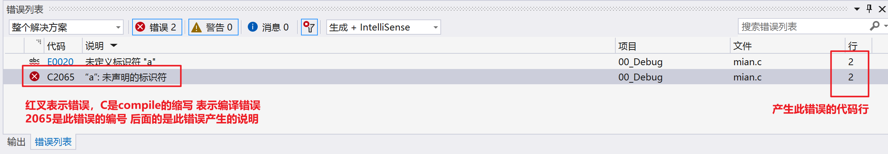
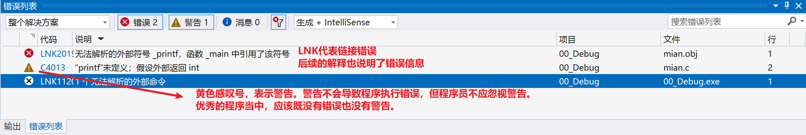
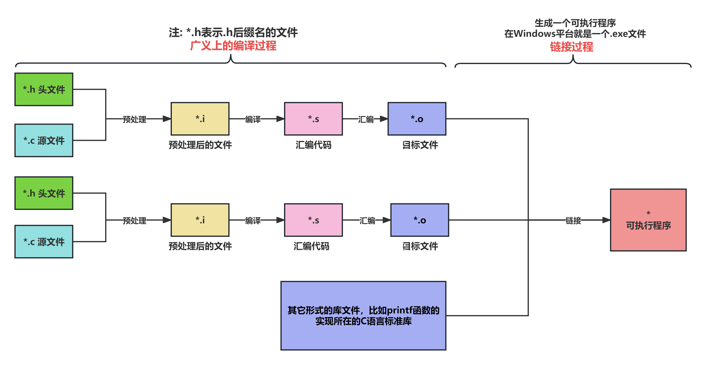
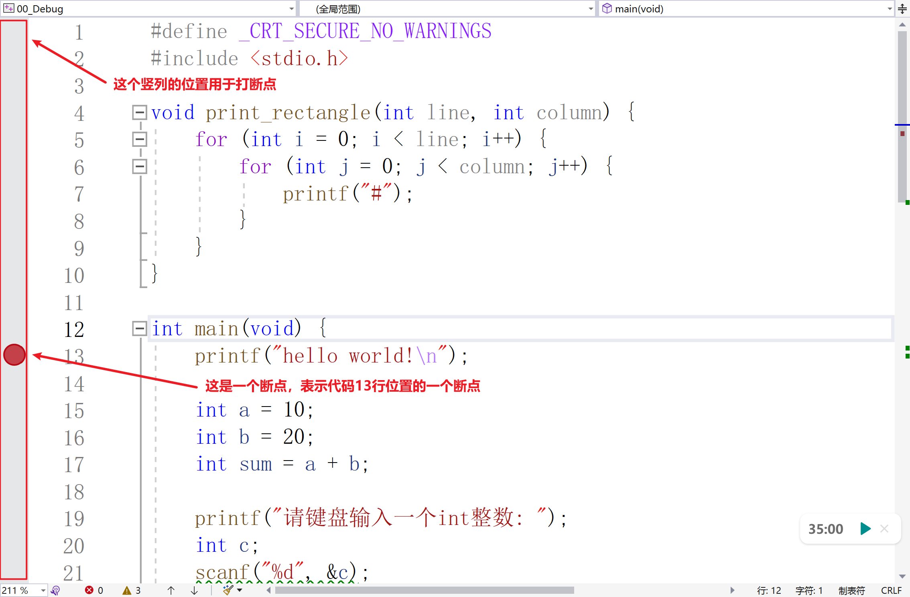
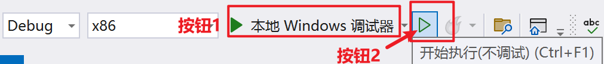
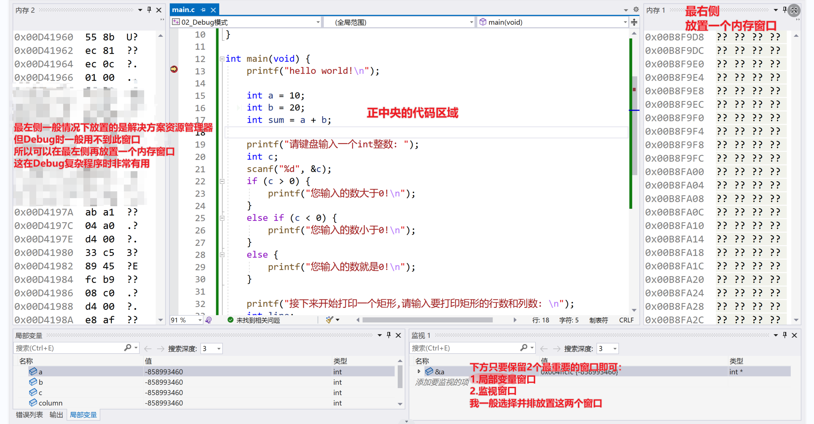
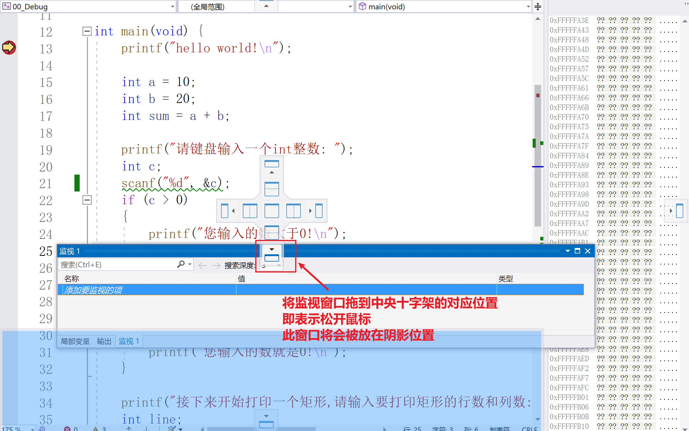
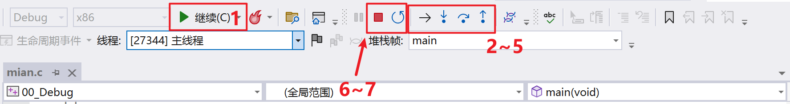
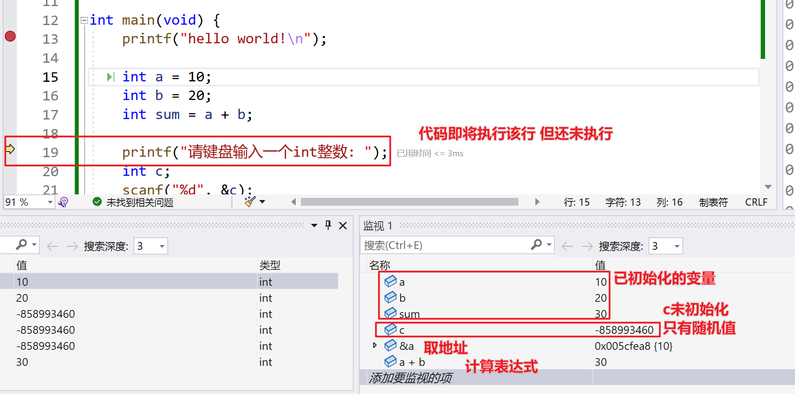
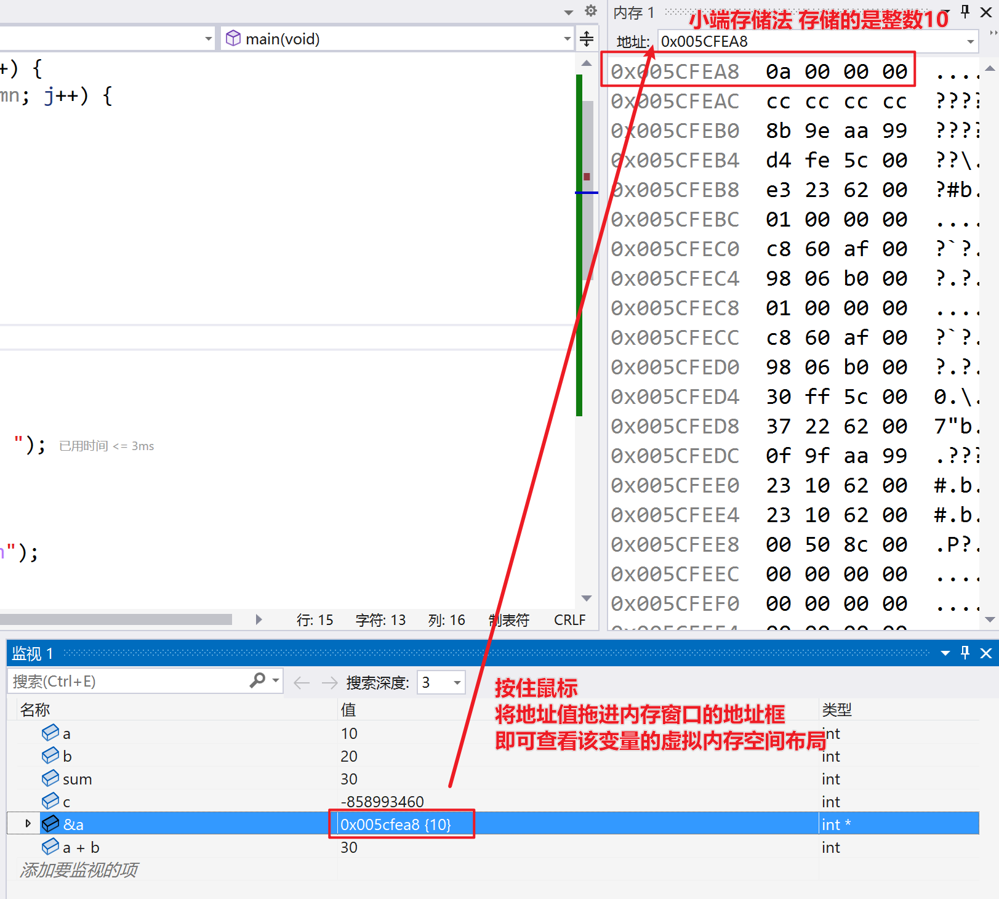

#  **使用VS调式程序**

# 概述

写代码总不是一帆风顺的，总会碰到一些问题，检查问题，排除错误**(也就是Debug程序)**，对于任何程序员而言都是基本功。

我们前面讲过，C语言是一门很容易出错，且自身不提供异常处理机制的语言，这导致程序员难以发现解决问题。

但好在利用集成开发环境Visual Studio写C语言代码时，VS给我们提供了一系列的手段来排查解决问题，这就是VS的Debug模式。

**本节课的内容很重要，VS的Debug模式不仅是重要的排错手段，也是学习C语言的利器，大家要认真学习。**

# 编译和链接的错误

要想使用VS的Debug模式来调试程序，那么首要的前提是程序能够正常启动，也就是程序的问题不能出现在"C源文件 --C可执行程序"的过程中。

我们都知道，在这个过程中，程序会经历编译(广义)和链接两大过程，所以在讲Debug模式之前，我们先给大家讲一下C程序启动时的编译错误和链接错误。

**注：**

VS的Debug模式用于调试运行时的错误，而不是编译或链接错误。编译和链接错误必须在程序运行之前解决。

## 编译错误

编译错误（Compile-time Errors）出现在代码的**编译(广义)**阶段，表示编译失败。**大多数的编译错误，实际上就是疏忽导致的语法错误**，比如：

1. 包含了错误的、不存在的头文件。（预处理阶段）
2. 忘记在语句结尾加上分号。
3. 小括号、中括号或大括号不匹配。
4. 类型不匹配，尝试将一个字符串赋值给一个整数类型的变量等。
5. 使用未声明的变量。
6. ...

在VS当中运行下列代码：


代码块 1. 编译错误-演示代码

```
int main(void) {
    a = 100;
    return 0;
}
```

这就是一个典型的编译报错。可以通过查看VS的错误列表窗口来检查这个错误：


图 1. VS-编译错误列表


当然，这个过程需要明确的是：

VS中的C语言代码编译是由内嵌的编译器MSVC完成的，编译错误的报错信息也是这个编译器给出的，然后通过VS的图形界面显示。

## 链接错误

链接错误（Linking Errors）出现在代码的链接阶段，表示链接失败。**链接错误大多和函数调用有关**，比如：

1. 调用函数时，把函数的名字写错了。比如想调用printf函数，但是写成了print。
2. 忘记包含头文件。比如使用printf函数但忘记写#include语句。
3. 没有定义一个函数却使用它。
4. ...

在VS当中启动下列代码：


代码块 2. 链接错误-演示代码

```
// 没有#include <stdio.h语句
int main(void){
    printf("hello world!\n");
    return 0;
}
```

这就是一个典型的链接报错。可以通过查看VS的错误列表窗口来检查这个错误：


图 2. VS-链接错误列表


和编译报错信息是编译器给出的一样，链接错误的信息也是链接器给出的。

无论是编译还是链接错误，大多都是简单的语法问题、或主观疏忽导致的。熟练的程序员，程序中即便出现这样的问题，也往往能很快速的解决。

**思考：为什么这些与函数调用相关的错误是链接器发出的链接错误呢？为什么不是编译错误呢？**

首先我们先谈两个关于函数的概念：

**函数声明：**指以`;`分号结尾的函数头。

比如：


代码块 3. C语言函数声明的语法

```
int test();     // 函数的声明语法
```

**显然函数的声明是不包含函数实现的，一个函数仅声明就像"局部变量仅声明"一样是不可以直接调用的。**

**函数定义：**指包含函数体的一个带有实现的，真正可以调用的函数。

比如：


代码块 4. C语言函数定义的语法

```
int test() {}       // 函数的定义语法，只要带有{}就是一个带实现可调用的函数
```

接下来我们思考标题的问题，这实际上还是由C程序编译和链接，生成可执行文件的过程决定的。在上一节，我们已经讲解了下图：


图 3. 编译和链接过程图


链接的过程允许将多个`.c`源文件合并成一个可执行程序，所以：

1. 某个`.c`源文件中的代码完全可以调用其它`.c`源文件中实现的函数
2. 某个`.c`源文件中的代码完全可以调用外部库函数

所以在编译的过程中，编译器并不会检查调用的某个函数是否真正定义(即函数是否有真正的实现)，最多只会检查它是否存在声明。

而到了链接阶段，链接器会将源代码中所有可能存在的外部引用进行解析，此时如果：

1. 调用了一个完全不存在的函数或者写错了函数名
2. 忘记包含头文件
3. ...

链接器就无法真正将函数的定义(实现)合并到目标文件中，此时链接器就会报错。(不报错不行了，再不报错程序就执行了，但此时代码显然无法执行)

**用通俗的话来说，C语言为了能够让程序员调用外部的函数（比如库函数），所以在编译阶段不检查函数的定义，最多检查声明。检查函数是否有定义这个事情，是链接器做的。**

# 用Debug模式调用时运行时问题(Bug)

如果一个程序没有编译和链接上的问题，那么它最终就能够生成可执行文件。当操作系统加载这个可执行文件到内存并运行时，程序开始执行。

但程序的执行经常会超出或不符合程序员的预期，这就是程序的运行时问题，也就是程序员常说的Bug。

为了解决这些Bug，程序员需要进行程序调试。Debug程序的过程，大体有以下几个步骤：

1. 大体判断问题的来源、从而模糊的定位问题
2. 定位具体的错误位置
3. 修改代码
4. 验证问题是否得到解决。

这些过程若全靠程序员凭借肉眼、经验去完成，很多时候是比较困难的。但好在现代集成开发环境（IDE）提供了强大的调试工具，如断点、变量观察、单步执行等，帮助程序员更有效地进行Debug。

VS同样也具有这样强大的功能，下面我们一起来学习一下VS的Debug模式。

首先，给出一段用于Debug演示的代码：


代码块 5. Debug模式-演示代码

```
#define _CRT_SECURE_NO_WARNINGS
#include <stdio.h>

void print_rectangle(int line, int column) {
    for (int i = 0; i < line; i++) {
        for (int j = 0; j < column; j++) {
            printf("#");
        }
    }
}

int main(void) {
    printf("hello world!\n");

    int a = 10;
    int b = 20;
    int sum = a + b;

    printf("请键盘输入一个int整数: ");
    int c;
    scanf("%d", &c);
    if (c 0){
        printf("您输入的数大于0!\n");
    }else if (c < 0) {
        printf("您输入的数小于0!\n");
    }else{
        printf("您输入的数就是0!\n");
    }

    printf("接下来开始打印一个矩形,请输入要打印矩形的行数和列数: \n");
    int line;
    int column;
    scanf("%d", &line);
    scanf("%d", &column);
    print_rectangle(line,column);

    return 0;
}
```

当然，这一段代码并非完全没有问题，实际上存在一个"bug"，我们可以通过Debug模式轻松找到这个问题并修正。

## 打断点

若想启动Debug模式，首先要做的就是打断点。 如何打断点呢？参考下图：


图 4. Debug模式-打断点


注意：

1. 如果没有打断点，Debug模式和普通模式启动程序是没有差别的。
2. 断点意味着代码以Debug模式启动时，**程序会在断点处暂停，并即将执行该行语句**。比如上图中一个位于main函数，第13行的断点，就表示程序启动后将于13行暂停，并即将执行第13行的代码。

## Debug模式启动程序

以Debug模式启动程序，在以前章节已经讲过了，也就是下图：


图 5. Debug模式-启动程序


点击下图中的**按钮1**，即表示使用Debug模式启动程序。而后面的**按钮2**，则是正常模式启动程序。

## 界面窗口布局

为了更好的使用Debug模式，推荐大家按照以下窗口布局：


图 6. Debug模式-窗口布局


所有需要的窗口，都可以在**"主界面调试" --"窗口"**下面找到。

如果搞乱了布局，都可以点击**"主界面窗口" --"重置窗口布局"**，重置布局。

若希望打开"解决方案资源管理器"，可以使用快捷键"Ctrl + Alt + L"。

**具体应该如何调整窗口布局？**

参考下图：


图 7. Debug模式-调整布局的方式


自己尝试一下即可，不要害怕弄乱布局，弄乱了重置布局即可。

## 功能按钮介绍

上面的都是前期准备，Debug模式调试程序的核心是围绕着一系列功能按钮展开的，如下图所示：


图 8. Debug模式-功能按钮介绍


逐一介绍：

1. 按钮1，"继续"按钮。表示立刻跳过当前的断点，转而在下一个断点暂停。若下面没有断点，则执行完毕整个程序，不再暂停。
2. 按钮2，"显示下一条语句"按钮。顾名思义，显示下一条即将执行的语句。（注意是即将执行，还没执行）
3. 按钮3，**"逐语句(快捷键为F11)"按钮**。执行下一条语句，如果碰到函数调用，则进入函数当中。
4. 按钮4，**"逐过程(快捷键为F10)"按钮**。执行下一条语句，但会将函数调用作为一条普通语句，直接执行完毕。
5. 按钮5，"跳出(快捷键为shift + F11)"按钮。直接执行完毕当前函数，回到该函数的调用位置。如果在main函数当中点击此按钮，则会直接将程序整个执行完毕。
6. 按钮6，"停止调试"按钮。
7. 按钮7，"重新开始"按钮。

以上，请大家自行尝试使用，熟悉每一个按钮的功能。你找到演示程序中的"Bug"了吗？

注：Debug过程，不仅要查看VS当中的窗口，还需要要配合查看控制台输出以确定程序的运行状态。

# 监视窗口

下面开始介绍上面提到的几个Debug窗口，首先介绍监视窗口。**监视窗口是我们日常Debug过程中，最常用的一个窗口。**

监视窗口的作用很简单，它允许你在调试过程中实时查看程序中变量的取值，还可以对它们做各种运算操作。这样，程序员就可以观察程序的运行状态，查找错误，修改bug等。

具体而言，在监视窗口中主要可以做到以下几个功能：

1. **查看变量的值：**可以查看和监控程序中所有变量或者表达式的当前值。
2. **修改变量的值：**你可以直接在监视窗口中修改变量的值，来观察程序的行为。
3. **计算表达式：**可以输入和计算表达式，观察表达式的值如何随着程序的执行而改变。
4. **查看变量的内存地址：**输入"&变量名"，即可查看变量的内存地址(值)。

这些操作大家可以自行探索，可以参考下图：


图 9. 监视窗口-使用示例

# 内存窗口

使用监视窗口得到变量的地址值后，可以将该地址值拖进到内存窗口的地址框，从而查看该变量在虚拟内存空间的内存布局。

如下图所示：


图 10. 内存窗口-使用示例


该窗口是很重要的，调试C程序是比较经常需要查看内存窗口的。

