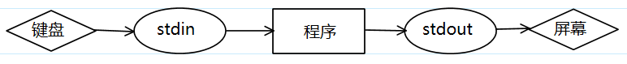
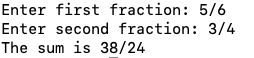

# **格式化输入和输出**

# 概述

格式化输入和输出其实指的就是C语言标准函数库<stdio.h>中的：

1. **scanf函数**，用于从键盘读取输入。
2. **printf函数**，用于向屏幕输出信息。

它们是C语言当中使用非常非常频繁的两个函数，所以很重要。

这两个函数的基本使用，比如对int/float数据的打印或者键盘录入，我们在前面的小节已经讲过了，这里不再赘述。

本小节主要讲解一下这两个函数的原理，以及其更强大的功能。

# 输入/输出模型

**scanf**和**printf**函数看起来一个是从键盘接收数据输入，一个是将数据输出打印到显示器，但计算机内部处理的过程却没有那么简单。

我们通过输入/输出模型来简单了解一下这两个函数大体上的执行原理。

## 冯诺依曼体系计算机

冯诺依曼体系计算机（也叫存储程序控制型计算机），主要包含三大核心组件：**CPU、IO设备以及存储器**，而存储器当中最重要的则是内存储器，也就是
**内存**。

直到今天，硬件设备的发展日新月异，但现代计算机仍没有脱离此体系。

冯诺依曼体系计算机，一个核心问题是CPU、内存以及IO设备三者之间的速度差异从而导致的性能瓶颈，这就是常说的"冯·诺依曼瓶颈”。

具体的说，这个瓶颈指的是：

CPU 的处理速度远远快于内存和 I/O 设备，导致在等待数据处理和传输时，CPU 大部分时间处于空闲等待的状态。这种速度差异造成了显著的性能瓶颈，限制了整个系统的效率。

为了平衡这三者之间的速度鸿沟，一个简单有效的手段是引入**缓冲区**技术，下面我们简单介绍一下缓冲区技术。

## 缓冲区

缓冲区本质上是一块临时存储数据的内存区域(一般是在内存中分配的)，它在速度较慢的内存和 I/O 设备与速度较快的 CPU 之间起到桥梁的作用。

为了更深入地解释缓冲的工作原理，以`printf`和`scanf`函数为例，可以更直观地解释其运作机制：

1. 当你使用 `printf` 输出数据时，数据并不是立刻写入到输出设备（如屏幕）。它首先被放置在一个**stdout缓冲区**
   中，然后在满足特定条件时，数据会被刷新到输出设备。
2. 当你使用 `scanf` 输入数据时，数据也不是直接从输入设备（如键盘）读取的。它首先被加载到一个**stdin缓冲区**中，然后 `scanf`
   从这个缓冲区中获取数据。

这个过程可以用下图来描述：

图 1. 格式化输入输出-缓存模型

那么添加这样的一个缓冲区有什么好处呢？

## 缓冲区的优点

使用缓冲区的好处显而易见——提高IO性能。

**缓冲区是如何提高IO性能的？**

printf函数和scanf函数：

1. printf函数将程序(内存)中的数据打印到外部设备(显示器)上
2. scanf函数代表从外部设备(键盘)中读取数据到程序(内存)中

这些都是非常典型的I/O操作过程。

我们都知道，I/O的过程效率很低。除了硬件性能本身的差异外，I/O操作的复杂性也是非常重要因素。每次进行I/O操作都会带来一些固定的开销，比如：

1. 每次 I/O 操作都需要设备初始化和响应等待等。
2. 操作系统管理 I/O 请求，涉及中断处理和上下文切换，这些都消耗了大量时间。
3. 应用从用户态切换到内核态的系统调用也会带来额外的时间开销。（I/O操作普遍涉及系统调用）
4. ....

总之，如果每输入或输出一个字符都要进行一次完整的I/O操作，那么这些固定的开销就会迅速积累，导致性能显著下降。

硬件层面的效率低下，我们没有办法通过软件层面的优化去解决。但对于这些大量的固定开销，我们可以通过缓冲区来进行效率优化。

缓冲区的主要目的是暂时存储数据，然后在适当的时机一次性进行大量的I/O操作。这样，多个小的I/O请求可以被组合成一个大的请求，有效地分摊了固定开销，并显著提高了总体性能。

拿上述两个函数，具体来说：

1. scanf函数。当从键盘输入时，输入的字符首先被保存在`stdin`
   的缓冲区中，而且是一次性将较多的数据读取到这个缓冲区，这样就减少了总的IO次数，提高了效率。而程序只需要从缓冲区读取并处理数据，这个过程是纯粹的内存交互，效率很高。
2. printf函数。输出到屏幕的内容会先被暂存到`stdout`的缓冲区。**当满足某个触发条件后**，这些内容会一次性写入并显示到屏幕，降低了与显示设备的交互频率。

如果你还不理解，就想象一次I/O操作就是搬运工搬运货物的过程，货物总量是一定的，搬一趟的时间也是差不多的。那么当然是一次性搬得尽量多，搬运的次数尽量少，总效率越高。

不使用缓冲区的I/O操作就像搬运工每次只能手提一个货物，频繁往返。而使用缓冲区，则好比搬运工使用了一个小推车，可以一次性搬运多个货物，大大提高了效率。

## 缓冲区的分类

从上述内容中，我们可以明确地看到缓冲区的一个显著特点：**当满足特定的条件时，程序会开始对缓冲区内的数据执行输入或输出操作。**

这种**“满足条件即触发数据传输”**的行为，被我们称为**“缓冲区的自动刷新”**机制。

基于这种自动刷新的触发条件的不同，我们可以将常见缓冲区划分为以下三种类型：

1. **全缓冲区，也叫满缓冲区。**顾名思义，仅当缓冲区达到容量上限时，缓冲区才会自动刷新，并开始处理数据。否则，数据会持续积累在缓冲区中直到缓冲区满触发自动刷新。
   **文件操作的输出缓冲区便是这种类型的经典例子。**
2. **行缓冲区。**缓冲区一旦遇到换行符，缓冲区就会自动刷新，所有数据都会被传输。**stdout缓冲区就是典型的行缓冲区。**
3. **无缓冲区，不缓冲。**在此模式下，数据不经过中间的缓冲步骤，每次的输入或输出操作都会直接执行。这种方法适用于需要快速、实时响应的场合。例如，stderr（标准错误输出）就是这种方式，它经常被用来即时上报错误信息。

**补充和注意事项：**

关于缓冲区，有以下几点需要特别注意：

1. **无论是哪种类型的缓冲区，当缓冲区满了时，都会触发自动刷新。**
    1. **全缓冲区**：唯一的自动刷新条件是缓冲区满。
    2. **行缓冲区**：除了缓冲区满导致的自动刷新，还有遇到换行符的自动刷新机制。
2. 手动刷新。大多数缓冲区提供了手动刷新的机制，比如使用**fflush函数**来刷新stdout缓冲区。
3. **输出缓冲区中的数据需要刷新才能输出到目的地，但输入缓冲区通常不需要刷新，强制刷新输入缓冲区往往会引发未定义行为。**
4. 当程序执行完毕（如main函数返回）时，缓冲区通常会自动刷新，除此之外，还有一些独特的机制也可以刷新缓冲区。但这些机制可能因不同的编译器或平台而异，不能作为常规手段。
   **强烈建议依赖手动或者常规自动刷新的机制来完成缓冲区的刷新。**
5. 不同的编译器和开发环境可能会对输出缓冲进行特殊设置，尤其是在调试模式下，以便提供更好的调试体验。比如在VS的Debug模式下，即使没有换行符，`printf`
   函数的输出通常也会立即显示在控制台上。这种行为是为了帮助程序员更有效地调试程序，即时看到他们的输出，而不需要固定等待缓冲区刷新条件。

至此，我们已经对输入输出的基本概念有了全面的了解。接下来，我们将深入探讨具体的函数如何使用。

当涉及到函数调用时，虽然查阅文档是重要的学习步骤，但真正的关键在于**实践：亲自编写和执行代码。**

# printf函数

printf函数的核心作用是将各种类型的数据转换为字符形式并输出到**stdout缓冲区**中。

从实际效果看，printf函数会展示**格式字符串**的内容，并在指定的位置插入**对应的值**。

调用printf函数时，首要参数是格式字符串。紧随其后的参数表达式则表示要插入到该字符串中的值。调用形式如下：

代码块 1. printf函数的函数声明

```
int printf(const char *format, ...);
// 该函数声明用中文表述如下：
printf(格式字符串, 表达式1, 表达式2, ...);
```

一个我们已经使用过的代码示例如下：

代码块 2. printf函数-打印int和float类型

```
int i, j;
float x, y;

i = 10;
j = 20;
x = 43.2892f;
y = 5527.0f;

printf("i = %d, j = %d, x = %f, y = %f\n", i, j, x, y);
```

格式字符串包含两个主要部分：

1. 普通字符，printf函数会将普通字符原封不动的进行显示。比如上面代码中的"i = , j = "。
2. **转换说明**，以字符% 开头，它为后续对应位置的表达式提供了一个占位符。在上述示例中，"%d"和"%f"就是转换说明。

理解转换说明的含义和用法是掌握printf函数的关键。

## 转换说明（重点）

转换说明在`printf`函数中起到了关键的角色，允许开发者对输出格式进行精细的控制。它主要有以下几个作用：

1. 占位符的作用。
2. 控制输出的格式，比如宽度，精度等。
3. **指示被转换成字符数据的对应参数的类型。**

系统的讲，转换说明的组成公式如下：

代码块 3. printf函数的转换说明格式

```
%[标志][字段宽度][.精度][长度]说明符
```

**注意，"%"和"说明符"是必不可少的，其余部分则是可选的！可选的部分用[]括起来了！**

下面，我们一步步详细地讲解每个部分：

1. "%"是转换说明的开始，必不可省略。
2. **[标志]**用于决定一些特殊的格式，常见的标志有：
    1. **-**：左对齐输出。如果没有该标志，输出默认是右对齐的。
    2. +：输出正负号。对于正数，会输出+，对于负数，会输出-。
    3. 0：当输出宽度大于实际数字的字符数量时，使用0而不是空格来填充。
    4. 空格：当数值为正时，在数值前面添加一个空格，而负数则添加-。如果同时使用了+标志，+标志会覆盖空格标志。
3. **[字段宽度]**用于指定输出的最小字符宽度，但不会导致截断数据：
    1. 如果输出的字符，宽度小于指定的宽度，那么输出的值将会按照指定的**[标志]**来进行填充。若标志位没有0，则会填充空格。
    2. 如果输出的字符，宽度大于指定的宽度，那么printf函数并不会截断，而是完全输出所有字符。
4. **[.精度]**定义打印的精度：
    1. 对于整数，表示要输出的最小位数，若位数不足则左侧填充0。
    2. 对于浮点数，表示要在小数点后面打印的位数。
        - 当有效数字不足时，会自行在后面补0
        - 当有效位数超出时，会截断保留指定的有效位数。这个过程一般会遵守"四舍五入"的原则。
        - **但由于浮点数存储的固有精度问题，某些数值可能不能完美表示，导致结果中的数字稍有偏差。**
        - **注意在不指定[.精度]的情况下，浮点数默认显示6位小数，多的部分舍弃，不够的话，会在后面补0。**
5. **[长度]**主要描述参数的数据类型或大小。常见的长度修饰符有：
    1. **h :** 与整数说明符一起使用，表示short类型。
    2. **l (小写的L):** 通常与整数或浮点数说明符一起使用，表示long（对于整数）或double（对于浮点数）。
    3. **ll (两个小写的L):** 与整数说明符一起使用，表示long long类型的整数。
    4. **L (大写的L):** 与浮点数说明符一起使用，表示long double。
6. **说明符，必不可省略。**描述如何格式化和显示该参数。常见的说明符有：
    1. **d** 或 **i** : 表示有符号的十进制整数。
    2. **u**：表示无符号的十进制整数。
    3. **o**：表示无符号的八进制整数。
    4. **x**：表示无符号的十六进制整数，使用小写字母（例如：`a-f`）。
    5. **X**：表示无符号的十六进制整数，使用大写字母（例如：`A-F`）。
    6. **f**, **e** 或 **E** : 浮点数。
        - **e**：强制用科学计数法显示此浮点数，使用小写的“e”表示10的幂次。
        - **E**: 强制用科学计数法显示此浮点数，使用大写的“E”表示10的幂次。
    7. **g** 或 **G** : 选择最合适的表示方式，浮点数或科学记数法。
        - g，当选择使用科学计数法显示此浮点数时，使用小写的“e”表示10的幂次。
        - G，当选择使用科学计数法显示此浮点数时，使用大写的“E”表示10的幂次。
    8. **c** : 字符。
    9. **s** : 字符串。纯粹打印字符串一般不需要用转换说明，直接使用普通字符输出即可。
    10. **p** : 指针。

通过结合这些组件，你可以精确地控制`printf`的输出格式。但是请不要尝试死记硬背，要在不断使用的过程中，逐渐理解记忆。当遇到不会写的格式或者忘记时，再及时查表即可。

## 转换说明中的特殊符号"%"

在转换说明中，有一个非常特殊的字符——"%"。百分号用于转换说明的开始，那么如果我就希望打印一个百分号咋办？

**很简单，用"%%"来表示一个"%"。**

例如：

代码块 4. printf转换说明中使用%字符

```
printf("Download progress: %d%%\n", progress);
```

在这个例子中，`printf`函数用于打印一条消息，表明了某项下载的进度，若progress等于80，则打印效果是：

Download progress: 80%

## 转换说明中的特殊符号"*"

假如给定一个浮点数：

代码块 5. printf转换说明中使用*字符-代码1

```
float a = 3.1415926f;
```

现在我的需求是以下列格式打印它：

1. 小数点后面保留2位
2. 打印结果字符串的总宽度是5

这个需求是很容易实现的，参考代码如下：

代码块 6. printf转换说明中使用*字符-代码2

```
printf("|%5.2f|", a);
```

打印结果是：

| 3.14|

现在我改变需求，希望能够用变量在程序运行时期确定打印小数点后的位数以及打印结果的总宽度，比如给定两个变量：

代码块 7. printf转换说明中使用*字符-代码3

```
int width = 5;
int point = 2;
```

那么该如何实现呢？

此时就需要用到转换说明中的特殊字符"*"，它的使用语法如下：

代码块 8. printf转换说明中使用*字符-代码4

```
printf("|%*.*f|", width, point, a);
```

该语句中的第一个"*"就表示将从`printf`函数的参数列表中动态获取宽度，也就是变量`width`作为宽度。

该语句中的第二个"*"就表示将从`printf`函数的参数列表中动态获取保留小数点位数，也就是变量`point`作为保留小数点位数。

`*`字符的存在，使得转换说明中的具体值可以动态的从函数的参数中获取，给格式字符串的使用带来了极大的灵活性，是一个非常重要的语法。

但是要注意，在scanf中`*`星号具有特殊的含义，不要和printf函数混淆了。

## %f和%lf转换说明

对于printf函数的转换说明%f和%lf，大家固有印象可能是：

1. `%f`表示输出float
2. `%lf`表示输出double

但实际上转换说明`%f`和`%lf`是完全等价的。

这是因为在C99及其以后的标准中，当使用`printf`函数打印浮点数数据时，不管参数是float还是double都会自动提升到double处理。

这一点实际上很容易验证，比如下列代码：

代码块 9. 验证%f和%lf转换说明的等价性

```
#include <stdio.h
int main() {
    double num = 123.456;
    printf("使用%%f打印的结果是: %f\n", num);
    printf("使用%%lf打印的结果是: %lf\n", num);
    return 0;
}
```

运行代码，两个转换说明的输出结果是一致的，就证明了它们的等价性。

**但是要注意，这个等价仅限于printf函数，scanf函数没有这样的特点！**

**scanf函数的%f和%lf转换说明，是完全不同的！**

## printf函数的返回值

`printf` 函数的返回值是一个 `int` 类型：

1. 在输出成功时，返回值表示函数实际输出的字符总数（不包括末尾的空字符）。即输出成功时，返回值是一个非负数，最小也是0。
2. 如果输出由于某些原因失败，那么返回值将会是一个负数。

演示代码如下：

代码块 10. printf函数的返回值-演示代码

```
int main(void) {
    int ret = printf("hello\n");
    printf("ret = %d\n", ret);      // 正常输出了6个字符，所以返回值是6

    int ret2 = printf("");
    printf("ret2 = %d\n", ret2);        // 正常输出了0个字符，所以返回值是0

    return 0;
}
```

**一般来说，printf函数的返回值比较少被接收处理，但某些场景中，该返回值可以用来检查输出操作是否成功执行。**

## 注意行缓冲区（重要）

printf函数将数据输出到stdout的行缓冲区，但要将这些数据真正展示到外部设备（如屏幕），则需依靠stdout的自动刷新机制。

为了增加输出的实时性和可预测性，**一个常见策略是在输出字符串的末尾添加换行符"\n"**
，这样可以立即触发缓冲区的刷新。这确保了待显示的信息能够迅速呈现，不会因其他因素延迟。

建议：

**在不影响程序的逻辑的前提下，调用printf函数的格式字符串应当总是以换行符"\n"结尾。**

## 小练习1

小练习当中，涉及的都是目前已经学习过的，并且比较常用的转换说明。

思考并回答以下代码的输出结果：

代码块 11. 转换说明-练习题1

```
printf("|%4f|\n", 3.14159f);
printf("|%10f|\n", 3.14159f);
printf("|%.4f|\n", 3.14159f);
printf("|%4.1f|\n", 3.14159f);
printf("|%04.1f|\n", 3.14159f);
printf("|% 4.1f|\n", 3.14159f);
printf("|%-4.1f|\n", 3.14159f);
printf("|%+4.1f|\n", 3.14159f);
```

实际输出的结果是：

|3.141590|

| 3.141590|

|3.1416|

| 3.1|

|03.1|

| 3.1|

|3.1 |

|+3.1|

代码块 12. 转换说明-练习题2

```
int i = 40;
float x = 839.21f;

printf("|%d|%5d|%-5d|%5.3d|\n", i, i, i, i);
printf("|%f|%10f|%10.2f|%-10.2f|\n", x, x, x, x);
```

实际输出的结果是：

|40| 40|40 | 040|

|839.210022|839.210022| 839.21|839.21 |

## 小练习2

请按照下列要求，编写代码：

1. 键盘输入一名学生的语文、数学和英语成绩（均为整数百分制）。计算其平均成绩，并保留两位小数打印显示。
2. 键盘输入一个位于(0, 1)范围内的浮点数，并将其转化为百分比形式，结果保留一位小数。例如：输入0.12转换为12.0%，而输入0.1234转换为12.3%。

参考代码：

代码块 13. 转换说明-练习题3参考代码

```
#include <stdio.h

int main() {
    int chinese, math, english;
    float average;

    printf("请输入语文成绩：");
    scanf("%d", &chinese);

    printf("请输入数学成绩：");
    scanf("%d", &math);

    printf("请输入英语成绩：");
    scanf("%d", &english);

    average = (chinese + math + english) / 3.0; // 使用 3.0 以确保结果是浮点数
    printf("平均成绩为：%.2f\n", average);

    return 0;
}
```

代码块 14. 转换说明-练习题4参考代码

```
#include <stdio.h

int main() {
    float input, percentage;

    printf("请输入一个(0, 1)范围的浮点数：");
    scanf("%f", &input);

    if (input <= 0 || input >= 1) {
        printf("输入值超出范围!\n");
        return 1; // 返回一个错误代码
    }

    percentage = input * 100; // 转换为百分比
    printf("转化后的百分比为：%.1f%%\n", percentage);

    return 0;
}
```

## 局部变量声明风格的说明

在早期的 C 语言标准（如 C89/C90）中，所有的局部变量必须在函数或代码块的开始处声明，这是**强制**的语法要求。

这种强制的语法设定，导致你会看到诸如下列代码：

代码块 15. 把局部变量声明放在函数开头-演示代码

```
int main(void){
 int i, sum = 0;
 for(i = 1; i <= 100; i++){
     sum += i;
 }

 printf("1 + 2 + ... + 100 = %d", sum);
 return 0;
}
```

但从C99标准开始，这个限制被放宽。在C99和之后的标准中，你可以在任何地方声明局部变量，只要在使用它们之间声明即可。

很显然这样，**程序员就可以在更接近局部变量的实际使用地方来声明它，从而提高代码的可读性和可维护性。**

综上，我们给出以下建议：

1. 对于现代的C编程而言，就近声明使用局部变量是更规范、更推荐的做法。因为这样做可以提高代码的可读性和可维护性。
2. 如果期望代码的兼容性更强，兼容更老的C语言版本，就必须把所有的局部变量在函数或代码块的开始处声明。但这种需求一般没有。

# scanf函数

**scanf函数**的核心作用是从**stdin缓冲区**中读取字符形式的数据，并将其转换为特定类型的数据。

从实际效果看，**scanf函数**会根据**格式字符串**读取输入的内容，并将这些内容赋值给指定的变量。

调用**scanf函数**时，首要参数也是格式字符串，**紧随其后的参数是变量的地址**，表示将读取到的值存放在哪个地址。调用形式如下：

代码块 16. scanf函数的声明

```
scanf(格式字符串, &变量1, &变量2, ...);
```

我们以往已经使用过scanf函数了，一个示例代码如下：

代码块 17. scanf函数-读取int和float类型

```
int i;
float x;

printf("输入整数: ");
scanf("%d", &i);

printf("输入浮点数：");
scanf("%f", &x);

printf("您输入的数据是: i = %d, x = %f", i, x);
```

**scanf函数**的格式字符串中可能包含：

1. 普通字符，比如空格和其他字符，**scanf函数**会期望输入中有与之匹配的字符。**一般来说，格式字符串不需要普通字符。**
2. 转换说明，以字符"%" 开头，它告诉**scanf函数**应该如何解释输入中的数据并如何存储它。在上述示例中，"%d"和"%f"就是转换说明。

值得注意的是，**scanf函数**在调用时填入的变量前面要加符号"&"，它是取地址运算符，意思是告诉scanf函数将数据存储到某个地址。*
*它一般是必须的，但有些情况下可以省略。**

## 转换说明

**scanf函数**使用转换说明来解析和读取输入，这为开发者提供了对输入数据格式的精细控制。

系统地讲，**scanf函数**的转换说明的组成公式如下：

%[*][宽度][长度]说明符

**其中，"%"和"说明符"是必不可少的，而其他部分则是可选的。我们用[]括起来表示这些可选的部分。**

接下来，我们逐一解释每个组成部分：

1. **"%"：**是转换说明的开始，并且是必不可省略的。
2. **[\*]也称之为赋值抑制：**当使用该符号时，对应的输入会被读取，但不会存储到任何变量中。例如，使用"%*d"
   意味着会读取一次输入，但此输入完全无效不会赋值到对应变量。
3. **[宽度]：**表示要读取的最大字符数量。例如，"%5d"意味着读取最多5个字符来解析为一个整数。
4. **[长度]：**描述参数的数据类型或大小。常见的长度修饰符有**（和printf函数一致）**：
    1. **h :** 与整数说明符一起使用，表示short类型。
    2. **l (小写的L):** 通常与整数或浮点数说明符一起使用，表示long（对于整数）或double（对于浮点数）。
    3. **ll (两个小写的L):** 与整数说明符一起使用，表示long long类型的整数。
    4. **L (大写的L):** 与浮点数说明符一起使用，表示long double。
5. 说明符：这是必不可少的部分，描述如何解析输入数据。常见的说明符有**（和printf函数一致）**：
    1. **d**: 表示有符号的十进制整数。
    2. **i：注意scanf函数的转换说明`i`和printf的是不同的。**
        - printf函数的i和d都是等价的，都表示输出有符号的十进制整数。
        - 但**scanf的i会自动判断输入的整数的进制，从而进行不同的录入。支持十进制、八进制、十六进制整数。**
    3. **u**：表示无符号的十进制整数。
    4. **o**：表示无符号的八进制整数。
    5. **x/X:** 表示无符号十六进制整数。
    6. **f, e, E, g, G:** 表示浮点数。
    7. **c:** 表示单字符。
    8. **s：**字符串。会读取连续的字符，直到遇到空白字符（如空格、制表符或换行符）为止。
    9. **p:** 指针。
    10. `%[字符集]`: 这告诉`scanf`只接受和存储来自指定字符集的字符。字符集是直接写在`[`和`]`之间的。例如，`%[abc]`
        将只读取'a', 'b', 或 'c'字符，其他的字符将导致读取停止。
    11. `%[^字符集]`: 这是扫描集的否定形式，告诉`scanf`接受和存储除了指定字符集之外的所有字符。`^`字符放在`[`
        之后立即表示否定。例如，`%[^abc]`将读取除了'a', 'b', 和 'c'之外的所有字符，直到遇到这三个字符中的任何一个为止。

和printf函数一样，当你在使用scanf函数时，建议不要死记硬背转换说明，而是在实践中逐渐熟悉并查阅文档或其他资料进行验证和参考。

## scanf函数的工作原理

**scanf函数**本质上是一个**"模式匹配"**函数，试图把**"stdin缓冲区"**中的字符与格式字符串匹配。

**scanf函数**会从左到右依次匹配格式字符串中的每一项：

1. 如果匹配数据项成功，那么scanf函数会继续处理格式串的剩余部分；
2. **如果匹配不成功，那么scanf函数将不再处理格式串的剩余部分，而会立刻返回。**

除此之外，scanf函数的转换说明符大都默认忽略前置的空白字符，这样的设计让输入对用户更好友好，比如：

1. %d: 忽略前置的**空白字符** (包括空格符、水平和垂直制表符、换页符和换行符)，然后匹配十进制的有符号整数。
2. %f:  忽略前置的空白字符，然后匹配浮点数。
3. ...

练习，下列代码的执行结果是什么？

代码块 18. scanf函数-练习题1

```
int i, j;
float x, y;
scanf("%d%d%f%f", &i, &j, &x, &y);
```

分别键盘录入以下数据：

100 200 0.1 0.2

1-20.3-4.0e3

100a2000.10.2

1002000.10.2

结果是什么呢？为什么？

## 录入字符数据的特殊性

注意事项：

**scanf 函数用 %c 格式化字符串来读取单个字符时，并不会跳过空白字符，%c 会读取输入的下一个字符，无论它是什么，包括空白字符。**

所以在录入字符时，尤其是一行录入多个数据且包含输入字符时，一定要在转换说明前面留出一个空格，以匹配可能的空格：

代码块 19. %c转换说明使用注意事项

```
char ch;
int num;
printf("请输入一个数字以及一个字符: ");
scanf("%d %c", &num, &ch); // 注意 %c 前的空格
printf("你输入的数字是: %d\n", num);
printf("你输入的字符是: %c\n", ch);
```

上述代码运行，键盘录入：

100 a

程序打印结果：

你输入的数字是: 100

你输入的字符是: a

## 普通字符

**scanf函数**的格式字符串串中也可以包含普通字符（"%"之前的部分是普通字符），和printf函数不同的是，**scanf函数的普通字符也用来表示匹配规则。
**

例如：

1. **空白字符**：对应输入中的任意数量的空白字符（如空格、制表符或换行）。
2. **非空白字符**：要求输入中精确地匹配该字符。**（是什么字符就匹配什么，写几个该字符就匹配几个）**

因此，scanf中的普通字符不仅仅是装饰或分隔，它们也参与到输入数据的匹配中，确保数据的格式正确。

代码块 20. scanf函数-练习题2

```
int i, j;
scanf("%d/%d", &i, &j);
```

分别键盘录入以下数据：

5/(空格)96

5(空格)/(空格)96

结果是什么？

其它不变，把转换说明改完"%d /%d"，再次录入数据，有区别吗？为什么？

## 缓冲区对scanf函数的影响

scanf函数是从标准输入缓冲区stdio从读取数据，而不是直接从键盘读取数据。

这句话很多同学是知道的，但没有完全理解。

我们来看一段普通的scanf代码：

代码块 21. 缓冲区对scanf函数的影响-示例代码

```
int num;
char ch;
scanf("%d", &num);
scanf(" %c", &ch);
```

该行代码执行如果正常进行键盘录入：

100

A

最终num和ch的结果分别是100和A，但如果键盘录入：

100A

最终结果是什么呢？

实际上结果仍然是100和A，那么为什么呢？

这是因为当键盘录入`100A`时，这一段数据会被放入stdin缓冲区，缓冲区中已有数据`100A`，然后scanf开始从缓冲区中读数据。

第一个scanf以转换说明`%d`读取整数，所以num变量的最终取值是`100`，而缓冲区中的`A`字符，第一个scanf是不会管它的。因为当 scanf
函数遇到一个不属于当前项的字符时，就返回了。

第二个scanf以转换说明`%c`读取字符，也是从缓冲区中读，缓冲区不为空，且恰好存在一个字符`A`，于是ch的最终取值就是`A`。

所以，在需要连续录入的场景中，我们要特别注意缓冲区中数据的变化，避免因此引发的一些问题。

## scanf函数的返回值

`scanf` 函数的返回值是一个 `int` 类型，它表明函数成功匹配并读取的输入项的数量：

1. 只要成功匹配并读取了一个数据输入项，那么函数的返回值就会是一个**正数**。注意，函数返回正数不意味着所有输入都能匹配成功，只要匹配成功一个输入项，返回值就是一个正数。
2. 如果返回值是**0**，那说明scanf没有成功匹配任何数据输入项，这通常是因为数据输入项**完全不匹配**。
3. 如果函数返回值是**负数**，说明scanf读到了EOF（流末尾）或者发生了错误。**在Windows系统终端里，键入"Ctrl + Z"
   表示输入EOF，在类Unix平台中，这个按键则是"Ctrl + D"，可以了解一下。**

这个返回值对于判断输入操作的结果非常重要，可以用来检查输入是否正确处理。

参考以下案例代码：

代码块 22. scanf函数的返回值-演示代码

```
#include <stdio.h

int main(void) {
    int num1, num2;
    char ch;
    int ret = scanf("%d %d %c", &num1, &num2, &ch);

    /*
        若键入的数据是100 200 A，则正常匹配录入3个数据，ret等于3
        若键入的数据是100 A 200，则正常匹配录入1个数据，ret等于1
        若键入的数据是A 100 200，则正常匹配录入0个数据，ret等于0
    */
    printf("ret = %d\n", ret);
    return 0;
}
```

在必要的时候，可以接收scanf函数的返回值，从而对函数调用的结果做出处理。

**扩展：输入输出系列函数**

scanf、printf函数不是孤立的，在C语言中还要两组常用的类似函数：

1. **fprintf / fscanf**
2. **sprintf / sscanf**

这两组函数在调用，函数返回值等特点上和scanf、printf函数是完全类似的，这一点大家可以记住，后续我们会详细学习这两个函数。

# 不要混淆 printf 函数和 scanf 函数

虽然scanf函数调用和printf函数调用看起来很相似，但这两个函数之间有很大的差异！

一个常见的错误是：调用`printf`函数时，在变量的前面加 &。

代码块 23. printf函数调用常见-错误写法

```
printf("%d, %d\n", &i, &j); /*** WRONG ***/
```

`scanf`函数在寻找数据项时，通常会跳过前面的空白字符。所以除了转换说明，格式串通常不包含其他字符。

一些常见混淆printf函数，导致的错误是：

代码块 24. scanf函数调用常见-错误写法

```
scanf("%d, %d", &a, &b);    // 这样写输入的数据必须是 "10, 20"格式的
scanf("%d\n", &a);      // 错误的添加换行
```

# 课堂小练习

写一个程序，实现分数相加。用户以分子/分母的形式输入分数，程序打印相加后的结果。如：

图 2. 综合练习题-图

拓展：如何将结果化为最简分数？

参考代码如下：

代码块 25. 课堂小练习-参考代码

```
int numerator1, denominator1;   // 第一个分数的分子和分母
printf("请输入第一个分数：");
scanf("%d/%d", &numerator1, &denominator1);

int numerator2, denominator2;   // 第二个分数的分子和分母
printf("请输入第二个分数：");
scanf("%d/%d", &numerator2, &denominator2);

// 分子错位相乘相加
int result_num = numerator1 * denominator2 + numerator2 * denominator1;
int result_denom = denominator1 * denominator2;

printf("sum = %d/%d", result_num, result_denom);
```

注意，变量命名要见名知意，不要乱用a、b、c等无意义字符。除此外为代码增加必要的注释也是一个非常好的编程习惯。